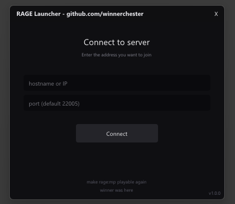
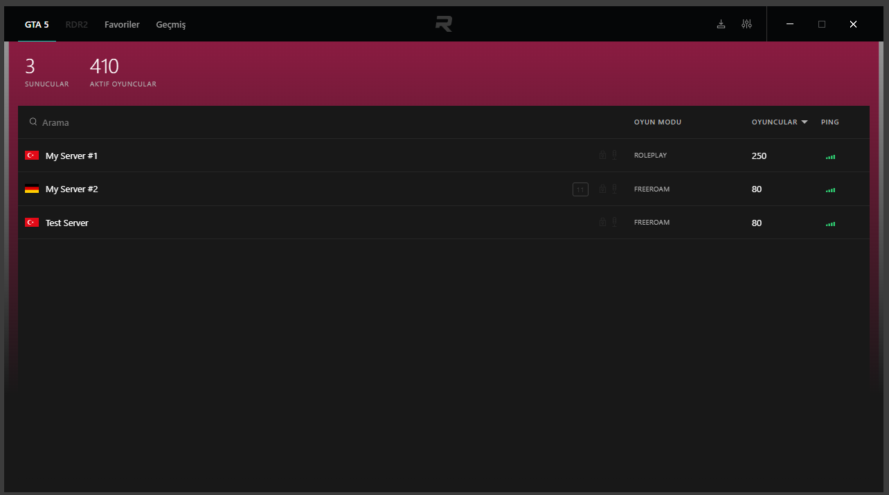
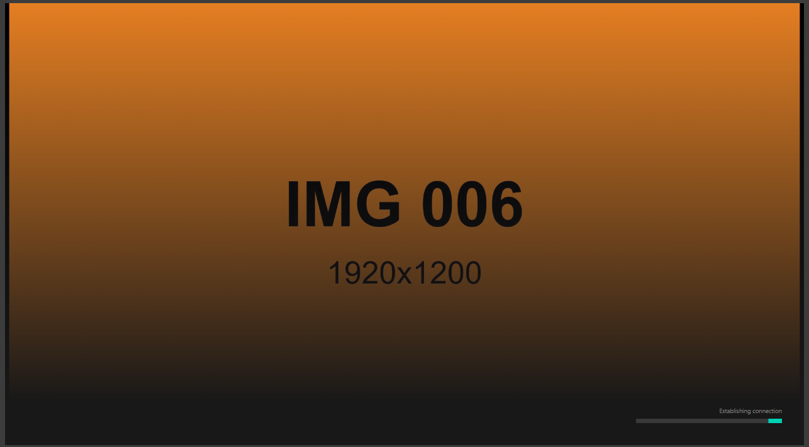

# tiny-ragemp-launcher

> ⚠️ **Disclaimer**
>
> This project exists solely to keep a shutting-down launcher alive. It has **no
> commercial use and no monetization** behind it. I respect the rights of Rockstar
> Games (Take-Two Interactive) and RAGE:MP — if an official objection is raised, I
> will take the project down entirely. What is done here falls under **abandonware
> preservation**.



Tiny ImGui frontend that wraps `RAGEMP\updater.exe`. Type IP + port, hit Connect,
launcher writes `HKCU\Software\RAGE-MP\launch2.{ip,port}` and spawns the updater
with cwd set to the RAGEMP folder. Updater reads the registry, skips its server
browser, and starts the game. (Both major Russian server launchers I reverse-engineered work exactly the same way.)

## Build

VS 2022 with the C++ workload, then:

    build.bat

Output: `build\tiny-ragemp-launcher.exe`. First run pulls ImGui v1.91.5 via CMake
FetchContent. Single ~570 KB exe, no DLLs to ship.

Looks for `RAGEMP\` next to itself. Drop a copy beside the exe.

## On the RAGE:MP shutdown

About 2-3 days ago the RAGE:MP team announced they're winding the platform down,
citing Rockstar/Take-Two's Platform License Agreement which names FiveM as the
only authorized GTAV multiplayer modder. Public listing dies June 1, 2026;
end-of-support August 31, 2026. Full statement here:
<https://rage.mp/forums/topic/26561-long-term-eco-system-integration-pt-ii-final-outreach-cd/>

A whole ecosystem getting nuked over a licensing dispute the community had no
seat at the table for is not great. Years of custom roleplay codebases, server
infra, third-party tooling — all expected to migrate to a platform that isn't
even API-compatible. 

The client and server binaries still exist on every machine that has them, and
this launcher proves the protocol still works fine — point it at any live
RAGE:MP server, registry write, spawn updater, done.

The catch: RAGE:MP isn't just a server list with a loading screen. Every launch
hits the Rage API (`cdn.rgsvc.io`), talks to the Rockstar Games API, and goes through Easy
Anti-Cheat. Pull any one of those down and every launcher in this category,
mine included, turns into a shortcut that errors out. The wrapper is only as
alive as the things it wraps.

## Updater Offline Bypass Patch

The official `updater.exe` requires CDN connectivity to `cdn.rgsvc.io` before
launching `ragemp_v.exe`. When offline or when the CDN goes down, it fails.

Six binary patches to `updater.exe` bypass the CDN check entirely:

| # | Offset | Original | Patched | Effect |
|---|--------|----------|---------|--------|
| 1 | 0x9393 | `A0 0F 00 00` | `32 00 00 00` | Transfer timeout 4000ms → 50ms |
| 2 | 0x9603 | `0F 8D BD 02 00 00` | `E9 BE 02 00 00 90` | Skip manifest retry loop |
| 3 | 0x98CB | `0F 85 84 4B 00 00` | `90 90 90 90 90 90` | Bypass connection error |
| 4 | 0x98D9 | `0F 85 76 4B 00 00` | `90 90 90 90 90 90` | Bypass connection error |
| 5 | 0xA04D | `0F 8E DE 0A 00 00` | `E9 DE 0A 00 00 90` | Skip file downloads |
| 6 | 0x99AA | `0F 84 96 04 00 00` | `E9 82 11 00 00 90` | Bypass manifest parse |

Apply with any hex editor or script. The patched updater calculates `upd` token
correctly, calls `ShellExecuteExW("ragemp_v.exe")` with proper params, and
the client loads offline.

## Domain Whitelist (solved)

`ragemp_v.exe` has a hardcoded domain whitelist for `launch2.ip` registry
values — only `*.gta5rp.com` and `*.grandrp.com` subdomains pass. Custom
domains like `play.xxxx.com` get rejected silently (registry cleared, server
browser loads instead of direct connect).

Two ways around it:

**1. hosts file** — map a whitelisted domain to your server IP:

```
# In C:\Windows\System32\drivers\etc\hosts
YOUR.SERVER.IP  myserver.gta5rp.com
```

Set `launch2.ip = myserver.gta5rp.com`. RAGEMP passes the whitelist check, DNS
resolves to your IP via hosts, connects to your server. Can be automated by the launcher.

**2. rui editor auto-connect** — set `auto_connect` (raw IP + port) in
`tools/config.json`. The UI calls `launchGame(ip,port)` directly with an IP, and the
whitelist only filters *domains* — a raw IP isn't subject to it, so any server works.

## RUI UI Editor (tools/)

`updater.exe` renders the launcher UI from `RAGEMP\cef\` + `RAGEMP\rui\index.rui` — a
webpack-built Vue SPA packed into a custom two-table archive (265 contiguous files,
entries stored raw). `tools/` is a config-driven editor that repacks it byte-exact:
an unmodified build reproduces the source identically. Pure Python, no deps.

    cd tools
    # set base_rui / out_rui in config.json to your index.rui paths
    python build.py

Edit `tools/config.json`:

| Key | Effect |
|-----|--------|
| `auto_connect` | call `launchGame(ip,port)` on UI load — auto-join on open |
| `server_list` | `override:true` replaces the shown list (empty it, or list your own); no master / `cache4.bin` needed |
| `colors` | remap theme hex colors (map in `palette.png`) |
| `texts` / `title` | replace any UI string / window title |
| images | drop a JPEG into `assets/images/img_XXX.jpg` — placeholders show which slot is which; `originals/` keeps the real ones |

The server-list override only changes what the browser *shows*; clicking a row still
connects through the normal `rageApi.launchGame` path.

Custom server list (3 entries from `config.json`):



Placeholder image as the loading background (`IMG 006` = that slot) + recolored loader bar:



## Roadmap

| Status | Task |
|--------|------|
| ✅ | Launcher — registry write + spawn updater |
| ✅ | Updater offline bypass — 6 patches, CDN check skipped |
| ✅ | RUI UI editor — config-driven, byte-exact repack |
| ✅ | Domain whitelist bypass — hosts file or rui auto-connect by IP |

